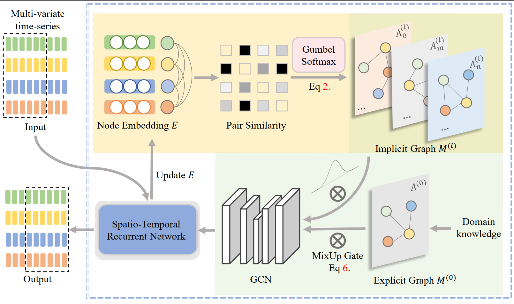
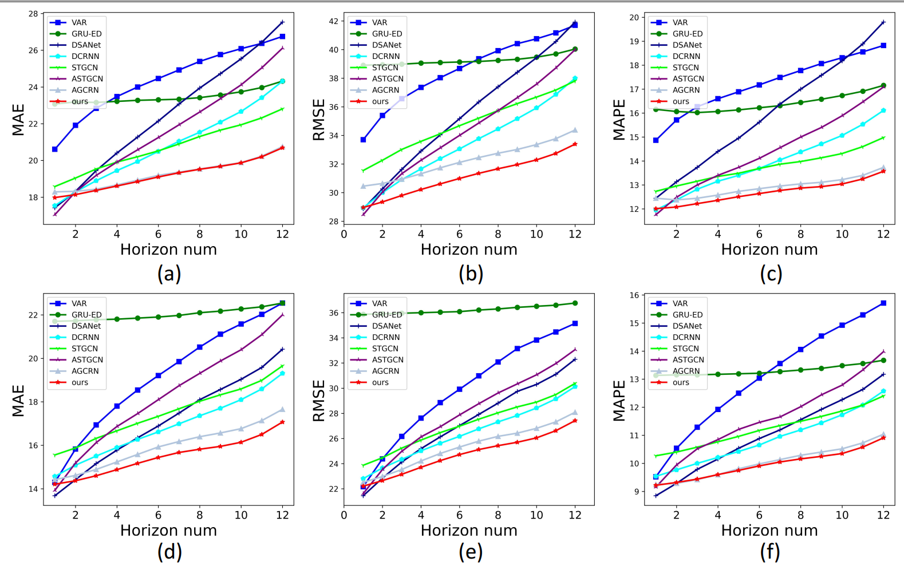
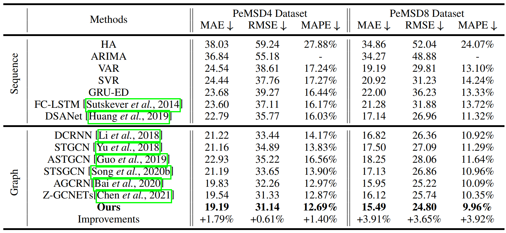

# Regularized Graph Structure Learning with Explicit and Implicit Knowledge for Multi-variates Time-Series Forecasting

This folder concludes the code and data of our RGSL model:

In this paper, we propose Regularized Graph Structure Learning (RGSL) model to incorporate both explicit prior structure and implicit structure together, and learn the forecasting deep networks along with the graph structure. RGSL consists of two innovative modules. First, we derive an implicit dense similarity matrix through node embedding, and learn the sparse graph structure using the Regularized Graph Generation (RGG) based on the Gumbel Softmax trick. Second, we propose a Laplacian Matrix Mixed-up Module (LM$^3$) to fuse the explicit graph and implicit graph together. We conduct experiments on three real-word datasets. Results show that the proposed RGSL model outperforms existing graph forecasting algorithms with a notable margin, while learning meaningful graph structure simultaneously.

  
  <!-- 
cell.
 -->

## Structure:

* data: including PEMSD4 and PEMSD8 dataset used in our experiments.

* lib: contains self-defined modules for our work, such as data loading, data pre-process, normalization, and evaluate metrics.

* model: implementation of our RGSL model

## Requirements

Python 3.6.5, Pytorch 1.1.0, Numpy 1.16.3, argparse and configparser

To replicate the results in PEMSD4 and PEMSD8 datasets, you can run the the codes in the "model" folder directly. If you want to use the model for your own datasets, please load your dataset by revising "load_dataset" in the "lib" folder and remember tuning the learning rate (gradient norm can be used to facilitate the training).

## Results

  
  <!-- 
cell.
 -->

  
  <!-- 
cell.
 -->

